# SkeletalAnimCompute: 从 CPU Skinning Matrix 到 GPU Compute Pipeline

## 1. 本文目标

`SkeletalAnimation` 的动画路径是 CPU 计算每个实例的最终 bone matrix，然后把 `std::vector<glm::mat4>` 上传到 `MODEL_BONE_BUFFER`，最后由 skinning vertex shader 读取。

`SkeletalAnimCompute` 的目标是把“最终 skinning matrix 生成”迁移到 GPU compute：

- CPU 仍负责动画采样：更新时间、选择 animation clip、把 channel 的 translation/rotation/scale 写回 node。
- CPU 不再为渲染主路径生成最终 bone matrix。
- CPU 改为打包 compute 所需的输入数据。
- GPU compute 先生成 node 的局部 TRS matrix，再沿 node 父链累乘，输出最终 bone matrix。
- graphics skinning pass 继续通过 vertex shader 做顶点蒙皮，但 bone matrix 来源变为 compute output buffer。

这份文档聚焦相对于 `SkeletalAnimation` 的改动、ComputePipeline 依赖对象图、以及它如何接入现有 NRI 管线。

## 2. 原始 SkeletalAnimation 路径

### 2.1 CPU 端每帧流程

原始路径的关键逻辑在 `Samples/SkeletalAnimation/src/Renderer/Renderer.cpp` 和 `Samples/SkeletalAnimation/src/Model/ModelInstance.cpp`：

```text
Renderer::Draw()
 -> updateCameraBuffer()
 -> updateModelBuffer(deltaTime)
    -> instance->UpdateAnimation(deltaTime)
       -> sample animation channels
       -> update node local matrices
       -> walk node tree on CPU
       -> mBoneMatrices[boneId] = nodeGlobalMatrix * boneOffsetMatrix
    -> append instance bone matrices into mModelBoneMatrices
    -> upload mModelBoneMatrices to MODEL_BONE_BUFFER
 -> recordCommandBuffer()
    -> bind skinning pipeline
    -> bind camera + bone buffer descriptor set
    -> draw instanced mesh
```

### 2.2 CPU 路径中的矩阵语义

CPU 旧路径的核心语义是：

```text
nodeGlobal = parentGlobal * rootTransform * localTranslation * localRotation * localScale
skinMatrix = nodeGlobal * boneOffset
```

其中：

- `rootTransform` 是 per-instance transform，通常只设置在 root node 上。
- `boneOffset` 是 Assimp bone 的 inverse bind matrix。
- `nodeGlobal` 由 node tree 的父子层级累乘得到。

这个语义非常重要。GPU compute 版本必须复现这个结果，否则动画会扭曲。

## 3. Compute 版本的总体改造

### 3.1 责任划分

`SkeletalAnimCompute` 不是把整个动画系统都搬到 GPU。它做的是更窄、更可控的迁移：

```text
CPU 保留：
- animation clip 时间推进
- channel 采样
- node 的 translation / rotation / scale 状态更新
- instance / model 分组
- compute 输入数据打包

GPU 接管：
- node local TRS matrix 生成
- node 父链累乘
- modelRoot * nodeGlobal * boneOffset
- 最终 bone matrix 写入 BONE_MATRIX_BUFFER

Graphics 保持：
- vertex shader 读取 bone matrix
- 顶点按 bone ids + weights 做 skinning
- mesh draw instanced
```

### 3.2 新增 shader

`Assets/SkeletalAnimCompute/shader/assimp_instance_transform.cs.hlsl`

- 输入：`StructuredBuffer<NodeTransformData>`
- 输出：`RWStructuredBuffer<float4x4> g_trsMat`
- 功能：把每个 node 的 translation、rotation quaternion、scale 转成局部 TRS matrix。

`Assets/SkeletalAnimCompute/shader/assimp_instance_matrix_mult.cs.hlsl`

- 输入：
  - node 局部 TRS matrix
  - node parent index
  - bone offset matrix
  - model root matrix
  - bone 到 node 的映射
- 输出：`RWStructuredBuffer<float4x4> g_boneMatrices`
- 功能：对每个 bone 找到对应 node，沿父链累乘得到 node global matrix，再乘 instance root 和 bone offset。

### 3.3 仍然使用的 shader

`Assets/SkeletalAnimCompute/shader/assimp_skinning.vs.hlsl`

- 仍然在 vertex shader 中做顶点蒙皮。
- 仍然读取 `StructuredBuffer<float4x4> g_BoneMatrices`。
- 变化是这个 buffer 不再由 CPU 直接写最终矩阵，而是由 compute pass 写入。

## 4. 数据结构改动

### 4.1 Renderer 的 buffer enum

`Samples/SkeletalAnimCompute/include/Renderer/Renderer.h` 中的 `BUFFER_INDEX` 扩展为多类 buffer：

```text
VP_MATRIX_BUFFER
WORLD_POS_BUFFER
NODE_TRANSFORM_BUFFER
TRS_MATRIX_BUFFER
MODEL_ROOT_MATRIX_BUFFER
NODE_PARENT_INDEX_BUFFER
BONE_NODE_INDEX_BUFFER
BONE_OFFSET_MATRIX_BUFFER
BONE_MATRIX_BUFFER
```

它们的用途如下：

| Buffer | 读写方 | 用途 |
| --- | --- | --- |
| `VP_MATRIX_BUFFER` | CPU -> graphics VS | camera view/projection |
| `WORLD_POS_BUFFER` | CPU -> graphics VS | 非动画模型实例矩阵 |
| `NODE_TRANSFORM_BUFFER` | CPU -> compute 1 | 每个 node 的 TRS 分量 |
| `TRS_MATRIX_BUFFER` | compute 1 -> compute 2 | 每个 node 的局部 TRS matrix |
| `MODEL_ROOT_MATRIX_BUFFER` | CPU -> compute 2 | 每个 instance 的 root transform |
| `NODE_PARENT_INDEX_BUFFER` | CPU -> compute 2 | 每个 node 的父 node 全局索引 |
| `BONE_NODE_INDEX_BUFFER` | CPU -> compute 2 | 每个 bone 对应哪个 node |
| `BONE_OFFSET_MATRIX_BUFFER` | CPU -> compute 2 | 每个 bone 的 inverse bind matrix |
| `BONE_MATRIX_BUFFER` | compute 2 -> graphics VS | 最终 skinning matrix |

### 4.2 QueuedFrame 扩展

`Samples/SkeletalAnimCompute/include/Model/RenderData.h` 中的 `QueuedFrame` 增加了多种 descriptor view 和 offset。

原因是这个 sample 使用 queued frames。每一帧都要拥有自己的 buffer slice，避免 CPU 写当前帧数据时覆盖 GPU 仍在读的上一帧数据。

因此每个 queued frame 都需要：

- camera buffer view
- static model matrix buffer view
- skinned bone matrix SRV
- compute 输入 SRV
- compute 输出 UAV
- 每类 buffer 在当前 queued frame 中的 offset

### 4.3 RComputePushConstants

`RComputePushConstants` 是两个 compute shader 共用的 root constants：

```cpp
struct RComputePushConstants
{
    uint32_t nodeTransformOffset;
    uint32_t boneMatrixOffset;
    uint32_t modelRootOffset;
    uint32_t numberOfNodes;
    uint32_t numberOfBones;
    uint32_t instanceCount;
};
```

它描述当前 dispatch 处理的是“全局 buffer 中哪一段模型实例数据”。

- `nodeTransformOffset`：当前模型这批实例的 node transform 起点。
- `boneMatrixOffset`：当前模型这批实例的 bone output 起点。
- `modelRootOffset`：当前模型这批实例的 model root matrix 起点。
- `numberOfNodes`：一个实例包含多少 node，作为 node stride。
- `numberOfBones`：一个实例包含多少 bone，作为 bone stride。
- `instanceCount`：这一批实例数，用于 shader 越界保护或未来 padding 策略。

`numberOfNodes` 和 `numberOfBones` 分开，是因为 node tree 和 bone list 不是同一个概念。bone 是被 mesh 权重引用的 node；node tree 里可能有 root、armature、helper、坐标修正节点或非直接受权重影响的中间节点。若只按 bone list 计算父链，某些模型会漏掉中间父节点变换。

## 5. 每帧 CPU 数据打包

### 5.1 updateModelBuffer 的新职责

`Renderer::updateModelBuffer()` 不再把最终 bone matrix 作为主路径结果上传。

新流程：

```text
for each model group:
  if animated:
    build node name -> node index map
    create AnimatedDispatch
    for each instance:
      instance->UpdateAnimationState(deltaTime)
      append instance local root matrix
      append every node's RNodeTransformData
      append every node's parent index
      append every bone's node index
      append every bone's offset matrix
    append AnimatedDispatch
  else:
    append instance world matrix

upload packed CPU vectors to queued frame buffer slices
```

`UpdateAnimationState()` 是从旧 `UpdateAnimation()` 中拆出来的轻量路径：

- 它只推进动画时间并采样 channel。
- 它不再为主渲染路径生成最终 `mBoneMatrices`。

旧 `UpdateAnimation()` 仍然保留，作为 CPU 路径语义参考和潜在调试工具。

### 5.2 AnimatedDispatch

`AnimatedDispatch` 是 Renderer 内部的 CPU 端描述：

```text
nodeTransformOffset
boneMatrixOffset
modelRootOffset
numberOfNodes
numberOfBones
instanceCount
```

它与 `RComputePushConstants` 字段基本对应。区别是：

- `AnimatedDispatch` 存在于 CPU vector 中，表示本帧有哪些 animated model batch 需要 dispatch。
- `RComputePushConstants` 是提交 draw/dispatch command 时写给 GPU 的 root constants。

## 6. ComputePipeline 依赖对象图

下面是 compute skinning 路径的对象依赖图：

```mermaid
flowchart TD
    Renderer["Renderer"]
    RenderData["RRenderData"]
    Device["nri::Device"]
    NRI["NRIInterface"]
    DescriptorPool["nri::DescriptorPool"]

    TransformLayout["rdComputeTransformPipelineLayout"]
    MatrixLayout["rdComputeMatrixMultPipelineLayout"]
    TransformPipeline["rdComputeTransformPipeline"]
    MatrixPipeline["rdComputeMatrixMultPipeline"]

    TransformShader["assimp_instance_transform.cs"]
    MatrixShader["assimp_instance_matrix_mult.cs"]

    QueuedFrame["QueuedFrame"]
    TransformSet["computeTransformDescriptorSet"]
    MatrixSet0["computeMatrixMultDescriptorSet0"]
    MatrixSet1["computeMatrixMultDescriptorSet1"]

    NodeTransform["NODE_TRANSFORM_BUFFER SRV"]
    TrsStorage["TRS_MATRIX_BUFFER UAV"]
    TrsSrv["TRS_MATRIX_BUFFER SRV"]
    BoneStorage["BONE_MATRIX_BUFFER UAV"]
    ParentSrv["NODE_PARENT_INDEX_BUFFER SRV"]
    BoneOffsetSrv["BONE_OFFSET_MATRIX_BUFFER SRV"]
    ModelRootSrv["MODEL_ROOT_MATRIX_BUFFER SRV"]
    BoneNodeSrv["BONE_NODE_INDEX_BUFFER SRV"]

    Renderer --> RenderData
    RenderData --> Device
    RenderData --> NRI
    RenderData --> DescriptorPool
    RenderData --> TransformLayout
    RenderData --> MatrixLayout
    TransformLayout --> TransformPipeline
    MatrixLayout --> MatrixPipeline
    TransformShader --> TransformPipeline
    MatrixShader --> MatrixPipeline
    QueuedFrame --> TransformSet
    QueuedFrame --> MatrixSet0
    QueuedFrame --> MatrixSet1
    TransformSet --> NodeTransform
    TransformSet --> TrsStorage
    MatrixSet0 --> TrsSrv
    MatrixSet0 --> BoneStorage
    MatrixSet1 --> ParentSrv
    MatrixSet1 --> BoneOffsetSrv
    MatrixSet1 --> ModelRootSrv
    MatrixSet1 --> BoneNodeSrv
```



### 6.1 PipelineLayout 依赖

compute pipeline layout 依赖：

- root constants：`RComputePushConstants`
- descriptor set descs
- shader stage：`COMPUTE_SHADER`

transform pass layout：

```text
set 0:
  t0 NodeTransformData SRV
  u1 TRS matrix UAV
root constants:
  RComputePushConstants
```

matrix multiplication pass layout：

```text
set 0:
  t0 TRS matrix SRV
  u1 Bone matrix UAV

set 1:
  t0 Node parent indices SRV
  t1 Bone offset matrices SRV
  t2 Model root matrices SRV
  t3 Bone node indices SRV

root constants:
  RComputePushConstants
```

### 6.2 DescriptorPool 依赖

descriptor pool 必须覆盖 graphics 和 compute 两部分：

- material texture/sampler sets
- static/skinned graphics buffer sets
- transform compute set
- matrix multiply compute set 0
- matrix multiply compute set 1
- structured buffer descriptors
- storage structured buffer descriptors

compute 输出 buffer 使用 `STORAGE_STRUCTURED_BUFFER`，对应 `RWStructuredBuffer<float4x4>`。

### 6.3 BufferView 依赖

同一个 physical buffer 在不同 pass 中可能需要不同 descriptor view：

- `TRS_MATRIX_BUFFER`
  - transform pass：UAV 写入
  - matrix pass：SRV 读取
- `BONE_MATRIX_BUFFER`
  - matrix pass：UAV 写入
  - graphics skinning pass：SRV 读取

因此每个 queued frame 都创建了对应的 storage view 和 shader resource view。

## 7. ComputePipeline 如何接入 Renderer 初始化

初始化顺序是关键：

```text
Renderer::Init()
 -> initDevice()
 -> initNRI()
 -> createStreamer()
 -> getQueue()
 -> createSyncObjects()
 -> createMatrixUBO()
 -> createSSBOs()
 -> createSwapchain()
 -> createSwapchainTextures()
 -> allocateAndBindMemory()
 -> createQueuedFrames()
 -> createDescriptorSetLayouts()
 -> createPipelineLayout()
 -> createPipelines()
 -> createDescriptorPool()
 -> createDescriptorSets()
 -> updateDescriptors()
```

相对于 `SkeletalAnimation`，关键变化在：

- `createSSBOs()` 增加 compute 输入/输出 buffer。
- `createDescriptorSetLayouts()` 增加 compute descriptor set layouts。
- `createPipelineLayout()` 同时创建 graphics layout 和两个 compute layouts。
- `createPipelines()` 创建两个 compute pipelines，再创建 graphics pipelines。
- `createDescriptorPool()` 为 compute descriptors 预留容量。
- `createDescriptorSets()` 为每个 queued frame 分配 compute descriptor sets。
- `updateDescriptors()` 创建并写入 compute SRV/UAV buffer views。

## 8. ComputePipeline 如何接入每帧命令流

每帧的命令流被插入到 graphics rendering pass 之前：

```text
recordCommandBuffer()
 -> CmdCopyImguiData()
 -> if animated dispatches not empty:
      barrier TRS/BONE buffers to storage write
      bind transform compute pipeline
      for each AnimatedDispatch:
        set RComputePushConstants
        dispatch transform pass
      barrier TRS buffer UAV write -> SRV read
      bind matrix multiply compute pipeline
      bind matrix descriptor sets
      for each AnimatedDispatch:
        set RComputePushConstants
        dispatch matrix pass
      barrier BONE_MATRIX_BUFFER UAV write -> vertex shader SRV read
 -> begin scene rendering
 -> draw animated/static models
 -> draw UI
 -> present
```

这个顺序保证：

- compute pass 写完 `BONE_MATRIX_BUFFER` 后，graphics skinning pass 才读取。
- TRS pass 写完 `TRS_MATRIX_BUFFER` 后，matrix pass 才读取。
- 所有命令仍在 graphics queue command buffer 中提交，避免额外 queue ownership 和 semaphore 复杂度。

## 9. 两段 Compute Shader 的数学关系

### 9.1 Transform pass

输入：

```text
translation
rotation quaternion
scale
```

输出：

```text
localTRS = T * R * S
```

注意：HLSL 中手写 quaternion 转 matrix 时，必须匹配 `glm::mat4_cast` 的语义。GLM 的矩阵按列组织，直接把列公式当作 HLSL 行写会产生转置旋转，表现为骨骼扭曲。

### 9.2 Matrix multiplication pass

输入：

```text
bone -> node index
node -> parent node index
node local TRS
model root matrix
bone offset matrix
```

输出：

```text
nodeGlobal = parentGlobal * nodeLocal
skinMatrix = modelRoot * nodeGlobal * boneOffset
```

这里与 CPU 旧路径对齐：

```text
CPU: mParentGlobalMatrix * mRootTransformMatrix * T * R * S
GPU: modelRoot * parentChain(T * R * S)
```

因为 CPU 旧路径只在 root node 上设置 `mRootTransformMatrix`，GPU 版把 per-instance root matrix 单独存入 `MODEL_ROOT_MATRIX_BUFFER`，并在最终 skinning matrix 阶段乘一次。

## 10. 为什么引入 numberOfNodes

`SkeletalAnimation` CPU 路径可以直接走 `Node` 对象和父指针，因此它不需要显式保存 node stride。

GPU 路径必须把数据线性化。每个实例的数据布局是：

```text
instance 0: node 0, node 1, ..., node N-1
instance 1: node 0, node 1, ..., node N-1
...
```

因此 compute shader 需要：

```text
nodeIndex = node + numberOfNodes * instance + nodeTransformOffset
```

如果只使用 `numberOfBones` 作为 stride，会错误地假设“每个 bone 就是一个 node，且父链也只经过 bone”。这对简单模型可能碰巧成立，但对包含 armature root、helper node、中间 transform node 的模型会出错。

## 11. 为什么引入 instanceCount

当前 compute shader 的线程布局是：

```hlsl
[numthreads(1, 32, 1)]
```

也就是：

- x 维负责 node 或 bone。
- y 维负责 instance。
- 每个 group 在 y 维有 32 个线程。

CPU dispatch 时通常要把实例数向上取整到 32：

```text
dispatchY = ceil(instanceCount / 32)
```

如果实例数不是 32 的倍数，最后一个 group 会产生多余线程。`instanceCount` 用于让 shader 判断这些线程是否有效。

未来如果改为 padding 策略，也可以让 CPU 把每批实例补齐到 32 的倍数，并为 padded instance 写 dummy data。那样 shader 可以去掉 `instance >= instanceCount` 分支，但 CPU 打包逻辑和 buffer 占用会增加。

## 12. 相对 SkeletalAnimation 的文件级改动

### 12.1 Renderer.h

新增内容：

- compute 需要的 buffer enum 项。
- `AnimatedDispatch`。
- compute 输入 staging vectors：
  - `mNodeTransformData`
  - `mNodeParentIndices`
  - `mBoneNodeIndices`
  - `mBoneOffsetMatrices`
  - `mModelRootMatrices`
  - `mAnimatedDispatches`

移除或替代：

- 主路径不再使用 `mModelBoneMatrices` 作为 CPU 生成的最终矩阵集合。

### 12.2 RenderData.h

新增内容：

- `RComputePushConstants`
- compute descriptor views
- compute descriptor sets
- per queued frame offsets
- compute pipeline layout / pipeline 指针字段

这些字段让 `RRenderData` 继续作为 renderer 资源中枢。

### 12.3 ModelInstance

新增：

- `GetLocalTransformMatrix()`
- `UpdateAnimationState()`

`UpdateAnimationState()` 是 CPU/GPU 职责拆分的关键。它只做动画状态采样，不再强制生成最终 bone matrices。

### 12.4 Node

新增：

- `GetNodeTransformData()`

这个函数把当前 node 的 translation、scale、rotation quaternion 转成 compute 输入结构。

### 12.5 Model

移除早期尝试中挂在单个 `Model` 对象上的 shader bone parent/offset buffer。

原因：

- 当前设计按 frame、model batch、instance 全局打包。
- parent index、bone node index、bone offset 都需要进入 queued frame 数据流。
- 把它们作为 `Model` 私有 GPU buffer 会让 descriptor 绑定、queued frame offset 和动态实例数管理变复杂。

### 12.6 Renderer.cpp

核心改动集中在：

- buffer size helper
- `updateModelBuffer`
- `recordCommandBuffer`
- `createQueuedFrames`
- `createPipelineLayout`
- `createPipelines`
- `createSSBOs`
- `allocateAndBindMemory`
- `updateDescriptors`
- `createDescriptorPool`
- `createDescriptorSetLayouts`
- `createDescriptorSets`
- `Cleanup`

## 13. Descriptor 接入表

### 13.1 Graphics static/skinning set

```text
set 1:
  b0 camera constants
  t1 matrix buffer
```

静态模型绑定：

```text
t1 = WORLD_POS_BUFFER SRV
```

动画模型绑定：

```text
t1 = BONE_MATRIX_BUFFER SRV
```

### 13.2 Transform compute set

```text
set 0:
  t0 = NODE_TRANSFORM_BUFFER SRV
  u1 = TRS_MATRIX_BUFFER UAV
```

### 13.3 Matrix compute sets

```text
set 0:
  t0 = TRS_MATRIX_BUFFER SRV
  u1 = BONE_MATRIX_BUFFER UAV

set 1:
  t0 = NODE_PARENT_INDEX_BUFFER SRV
  t1 = BONE_OFFSET_MATRIX_BUFFER SRV
  t2 = MODEL_ROOT_MATRIX_BUFFER SRV
  t3 = BONE_NODE_INDEX_BUFFER SRV
```

## 14. Barrier 接入表

| 阶段 | Buffer | Before | After | 目的 |
| --- | --- | --- | --- | --- |
| compute 开始前 | `TRS_MATRIX_BUFFER` | shader resource | shader resource storage | 允许 transform pass 写 |
| compute 开始前 | `BONE_MATRIX_BUFFER` | shader resource | shader resource storage | 允许 matrix pass 写 |
| transform 后 | `TRS_MATRIX_BUFFER` | shader resource storage | shader resource | 允许 matrix pass 读 |
| matrix 后 | `BONE_MATRIX_BUFFER` | shader resource storage | shader resource | 允许 vertex shader 读 |

因为 compute 和 graphics 在同一个 command buffer 中按顺序提交，这里的 barrier 负责资源访问状态和可见性转换。

## 15. 常见错误和诊断点

### 15.1 骨骼扭曲

优先检查：

- quaternion 转矩阵是否匹配 `glm::mat4_cast`。
- HLSL 的 matrix 字面量是否按 row 写。
- 父子矩阵是否为 `parent * child`。
- 最终矩阵是否为 `modelRoot * nodeGlobal * boneOffset`。
- Assimp matrix 转 GLM 时是否已经做过转置。

### 15.2 模型整体位置正确但骨骼局部错乱

优先检查：

- `boneNodeIndices` 是否按 `boneId` 排列。
- `boneOffsetMatrices` 是否按同一个 `boneId` 排列。
- node parent index 是否指向同一 instance 的 node slice。
- `numberOfNodes` 和 `numberOfBones` 是否混用。

### 15.3 有些实例正确，有些实例错

优先检查：

- per-instance offset 是否正确。
- queued frame offset 是否正确。
- dispatch 的 instance y 维是否越界。
- 如果去掉 shader 分支，是否做了 32 对齐 padding。

### 15.4 Vulkan validation 报 unknown structure

这通常与 NRI/Vulkan headers 和本机 validation layer 版本有关，不是 compute skinning 本身的矩阵错误。

典型例子：

- `VK_KHR_maintenance10`
- `VK_STRUCTURE_TYPE_PHYSICAL_DEVICE_MAINTENANCE_10_FEATURES_KHR`
- `VK_STRUCTURE_TYPE_PHYSICAL_DEVICE_MAINTENANCE_10_PROPERTIES_KHR`

## 16. 当前设计的取舍

### 16.1 为什么不是全 GPU animation

当前版本没有把 channel interpolation 放到 GPU。原因：

- animation clip 数据结构更复杂。
- GPU 端需要处理 keyframe 查找、插值、clip duration、不同 channel 缺省值。
- 先迁移最终矩阵生成，可以复用现有 `AnimChannel` 和 `ModelInstance` 逻辑，风险更低。

### 16.2 为什么按完整 node tree 而不是 bone list

完整 node tree 更接近 Assimp/GLTF 的实际层级语义。许多模型的动画通道或父链会经过非 mesh-weighted bone node。

按 bone list 做父链的风险是：

- 中间 transform node 被跳过。
- root/armature transform 被重复或漏乘。
- 某些模型正常，另一些模型严重扭曲，问题不稳定。

### 16.3 为什么每帧上传 parent/bone offset

当前实现为了让数据布局简单，所有 compute 输入按 queued frame 打包。parent index 和 bone offset 理论上是 per-model 静态数据，可以后续优化成 per-model GPU resident buffer。

这个优化方向需要：

- per-model descriptor 或 bindless/descriptor indexing 策略。
- runtime model add/delete 时的资源生命周期管理。
- descriptor pool 和 set 更新策略重新设计。

当前版本优先选择可读性和正确性。

## 17. 后续优化路线

### 17.1 去掉 shader 越界分支

可选方案：

- CPU 把每批 instance 数补齐到 32 的倍数。
- padded instance 写 identity TRS、identity root、identity offset、安全 parent/bone-node index。
- compute dispatch 使用 padded count。
- graphics draw 仍使用真实 instance count。

这样可以去掉：

```hlsl
if (node >= numberOfNodes || instance >= instanceCount) return;
```

但 CPU 打包更复杂，buffer 占用略增。

### 17.2 静态数据常驻 GPU

可优化：

- `NODE_PARENT_INDEX_BUFFER`
- `BONE_NODE_INDEX_BUFFER`
- `BONE_OFFSET_MATRIX_BUFFER`

这些数据通常只依赖模型，不依赖实例和帧。

### 17.3 GPU animation sampling

更进一步可以把 clip/channel 数据上传 GPU，由 compute shader 完成 keyframe 查找和插值。那时 CPU 只提交 time、clip id、instance settings。

这会显著改变数据结构和 shader 复杂度，适合作为下一阶段专题。

## 18. 阅读顺序建议

建议按这个顺序读代码：

1. `Samples/SkeletalAnimCompute/include/Renderer/Renderer.h`
2. `Samples/SkeletalAnimCompute/include/Model/RenderData.h`
3. `Samples/SkeletalAnimCompute/src/Renderer/Renderer.cpp::updateModelBuffer`
4. `Samples/SkeletalAnimCompute/src/Renderer/Renderer.cpp::recordCommandBuffer`
5. `Samples/SkeletalAnimCompute/src/Renderer/Renderer.cpp::createDescriptorSetLayouts`
6. `Samples/SkeletalAnimCompute/src/Renderer/Renderer.cpp::updateDescriptors`
7. `Assets/SkeletalAnimCompute/shader/assimp_instance_transform.cs.hlsl`
8. `Assets/SkeletalAnimCompute/shader/assimp_instance_matrix_mult.cs.hlsl`
9. `Assets/SkeletalAnimCompute/shader/assimp_skinning.vs.hlsl`

读完后应能回答：

- CPU 每帧上传的不是最终 bone matrix，而是什么？
- 两个 compute pass 分别写哪个 buffer、读哪个 buffer？
- 哪个 barrier 让 `BONE_MATRIX_BUFFER` 从 UAV 写转为 vertex shader SRV 读？
- 为什么 `numberOfNodes` 不能简单用 `numberOfBones` 替代？
- 为什么 quaternion matrix 的行列约定会直接导致骨骼扭曲？
